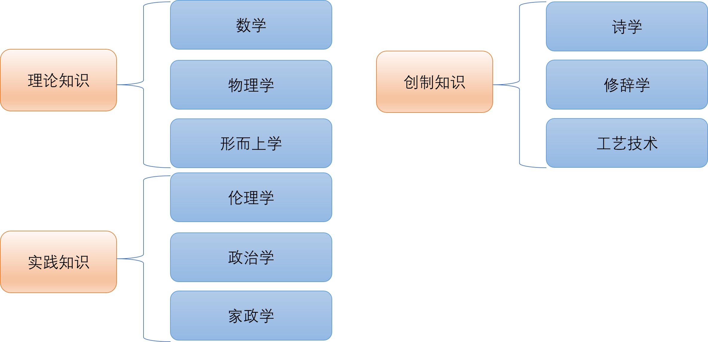

---
author:
- name: Yuxin Fu
  orcid: 0009-0003-0905-0207
title: "变得有文化：西方哲学史入门"
subtitle: "古希腊哲学篇"
date: '2025-10-01'
categories:
  - 哲学史
  - 古希腊哲学
image: featured.jpg
google-scholar: false
number-sections: true
langid: zh
---

# 前言 {.unnumbered}

本项目旨在为读者提供一份系统、易懂的西方哲学史入门指南，涵盖从古希腊到现代的主要哲学流派和思想家。通过对关键概念和历史背景的介绍，帮助读者建立起对西方哲学发展的整体认识。

本项目主要脉络来自于[大问题Dialetic](https://space.bilibili.com/1871365234)的课程[看透世界：100个哲学大概念开悟人生](https://uland.taobao.com/ccoupon/edetail?e=pG8tgqFlRGalhHvvyUNXZfh8CuWt5YH5OVuOuRD5gLJMmdsrkidbOWBzzpT26idJJ8%2BPOO9hQDjfR64HYbb1gJOjMBbjzx9dZASEO%2BgtNYbnbg2B%2FbwJh7ELmwLZsHaS3UNLwX0aLdsR9msLEk0PStVqM6BWlz38%2Fjq54BMmbHC0G7vmUYRVhrZB4GXhba7v6cxYIVw%2FVyB1MwR8hKy%2BnO4iIKnGe65Xk7yRgU3VIGWVDZN8GCVDLxdK6pkbP5gnWpfvhT2m9KEp7uXHnVOf6%2F95uwf5352f9TS6ytr6o7PN0FOGyiept6X7yYwLhHdUG7LK5J%2F6dFMVn3BHYA8n1mwaG%2B%2FcL987wq6s0BpGuAa9fpd4BHQqQlsQ6JMpHki%2BBox4xTs%2FS81RjkXyu8GkkqKtBdjOrRJBsR25VcoNzMcp%2F78wCZVOOEjBABGEtczXfjHMNTxsYKRroXBFP6oz%2BA%3D%3D&traceId=210730bf17544730921384267ec983&union_lens=lensId:TAPI@1754473092@0bb74356_0e27_1987ebed4aa_c46a@01&cont_id=BV11CtFzcEVo)。文稿内容由作者与AI大模型协同完成。

# 引言 {.unnumbered}

西方哲学的起源可以追溯到古希腊时期，那是一个思想蓬勃发展、智慧之光初现的时代。从最早的自然哲学家到苏格拉底、柏拉图的理性主义传统，古希腊哲学为后世奠定了深厚的思想基础。

本节我们将从自然哲学家们对世界本原的探索开始，经由苏格拉底，柏拉图，最终到达古希腊哲学的集大成者，亚里士多德。

# 第一章：古希腊哲学起源

## 泰勒斯： 水是万物的本原

古希腊哲学的开端通常被认为是公元前6世纪的**米利都学派**，而其中最著名的代表人物是**泰勒斯**。他提出了一个大胆的命题：**“水是万物的本原”**。

### 什么是“本原”？

**“本原”（Arche）**是理解早期希腊哲学的核心概念。它不仅指时间的开端或物质的来源，更是一种贯穿始终的根本原则。

正如**亚里士多德**所说，“一切存在着的东西由它而存在，最初由它生成，毁灭后又复归于它，万物虽然性质多变，但实体却始终如一。”

因此，追问 **“本原”**的哲学冲动，实质上是在纷繁杂乱的现象世界背后，寻找一个形而上学的、永恒不变的实在。这个实在是一切变化和多样的终极解释，是宇宙秩序的逻辑基石。

循着**泰勒斯**的思路，后来的**自然哲学家**们展开了一场关于世界本质的智力竞赛。**阿纳克西曼德**认为本原是超越具体物质的 **“无定”（Apeiron）**；**阿那克西美尼**则主张 **“气”（Air）**是万物的始基；**赫拉克利特**认为是 **“火”**；**恩培多克勒**提出了 **“水、火、土、气”**四种元素；**阿那克萨戈拉**则认为是无数的 **“种子”**；到了**德谟克里特**，最终归结为不可再分的**“原子”**。尽管答案各异，但他们共享着同一种信念：可以用一个（或一些）**不变的、本质性的事物**，来解释无数**变动着的、现象性的事物**。

### 自然哲学：用自然解释自然

泰勒斯和他的继承者们被称为**“自然哲学家”（Physiologoi）**，因为他们开创了一种全新的解释范式：**用自然本身的力量和法则来解释自然**，而非诉诸**神祇的干预或超自然的力量**。这在人类思想史上是一次哥白尼式的革命，它标志着理性精神的独立，是科学与哲学共同的源头。

然而，这种解释范式也内含着它的时代局限性。由于直接从**经验观察**出发，他们倾向于将日常生活中熟悉的事物（如水、气、火）提升为宇宙的终极原理，这使得他们的理论带有一种**“朴素唯物主义”**的色彩，其中不乏直观的想象成分。后世的哲学，尤其是在**柏拉图**之后，逐渐超越了这种经验的束缚，转向了更为抽象的、超越于感官世界的形而上的探索。

## 阿纳克西曼德：万物的本原是“无定”

在**泰勒斯**之后，他的学生**阿纳克西曼德**将关于本原的思考推向了一个更高的抽象层次。他认为，本原不可能是水、火之类的任何一种**具体物质**，因为任何**具体物质**都是有特定性质、有限定的。如果本原是水，就无法解释其对立面——火的存在。因此，真正的本原必须是**“无定”（Apeiron）**。

**“Apeiron”**一词意为**“无限定者”**或**“无限者”**，它没有边界，没有特定的形态或性质，是一切具体事物从中产生又复归于其中的永恒母体。

### 本质不可说

**阿纳克西曼德**的创见在于，他认识到，作为一切限定事物之源头的东西，其本身必须是**无限定的、不可描述的**。这一思想的深远影响，贯穿了整个西方思想史。

比如，在**中世纪的基督教神学**中，**“无定”**回响为**“上帝是不可言说的”**这一观念。**否定神学**认为，上帝的本质超越了人类语言和理性的极限，我们无法用任何正面的词汇去描述上帝是什么，只能通过否定他不是什么来间接趋近他的实在。例如，在描述上帝时，不说“上帝是善良的”、“上帝是智慧的”，而说“上帝不是有限的善”、“上帝不是无知的”、“上帝不是物质的”。正如托马斯·阿奎那在《神学大全》中指出：**“我们不能说上帝是什么，只能说上帝不是什么。”**因此，神学家会用“上帝是不可见的、不可分的、不可变的、无限的”等否定性表述，强调上帝超越一切人类经验和概念。

近代，康德的**“物自体”**概念也与此遥相呼应。康德认为，我们只能认识经由我们感官和知性结构所呈现的**“现象”**，而事物**本身的面貌**则永远无法企及。甚至在当代物理学的**奇点理论**中，“奇点”同样被描述为一个密度无限大、时空曲率无限高、无法用现有物理定律描述的点。

维特根斯坦在《逻辑哲学论》的结尾处说：“对于不可言说的东西，我们必须保持沉默。” “**我们为什么会有“存在”的世界，而不是根本什么都没有？**”这个终极问题似乎永远盘旋在人类理性的边界。**阿纳克西曼德**提出**“无定”**作为一切存在的本原，正是试图回答**“存在从何而来”**这个终极问题。**“无定”**不是某种具体的存在，而是**超越一切限定、没有边界和性质的“无限者”**。它既不是“有”，也不是“无”，而是“有”与“无”的根源。所有具体的存在都从**“无定”**中产生，最终又归于**“无定”**。因此，**“无定”**提供了一种哲学上的解释：存在之所以不是“全然无”，是因为有一个超越一切的本原作为一切存在的可能性和源泉。

## 赫拉克利特：人无法两次踏入同一条河流

**赫拉克利特**，常被称作"晦涩者"或"哭泣的哲学家"。他出身于以弗所的贵族家庭，却放弃王位继承权，隐居于阿耳忒弥斯神庙附近。他用断简式格言写作，不给体系，不铺细论，却以极高的密度提出几条贯穿古今的洞见。据说他只写了一部著作，寄存在神庙里，后世只能从其他作家的引文中拼凑出约130个残篇。

他有一句名言：**"人无法两次踏入同一条河流"**，因为河水时时更替，人的状态也在更替，恒常并不在于"这同一撮水"或"这同一瞬间的我"，而在于一个通过变化而自我维持的秩序。**克拉底鲁**后来更激进地说："人连一次也无法踏入同一条河流"，把赫拉克利特的思想推向了极端的流变论和相对主义。

其实，**赫拉克利特**真正想表达的是：**"一切皆流，无物常驻"**。这个**世界上并没有什么永恒不变的本质，唯一不变的就是变化本身。**但这并不意味着世界陷入混乱：变化本身是有秩序的，河流之所以仍然是"同一条河"，正是因为它遵循着河道的界限和水流的规则。

### 世界是一团永恒燃烧的大火

**赫拉克利特**提出**“世界是一团永恒燃烧的大火”**，其所谓**“火”**并非一种具体的物质，而是一种持续运动与转化的过程。这一象征性的说法意在刻画万物在生成与消逝之间不停流转的状态：**一切皆流，无物常驻。**大火并不指向某个固定的实体，而是指向一种始终在进行的变化本身。在这团火的燃烧与熄灭、炽盛与衰退的往复中，世界呈现出一种循环的节律。对赫拉克利特而言，正是这样的永恒流变构成了世界的基本面貌。

当他描述“火”的运动时，强调了向下与向上的双向过程：向下，火的势能退却、冷却与凝聚，显现出熄灭与分化的路向；向上，火又复炽、舒张与高扬，完成再度点燃与统一的路向。世界便在这种张与弛、炽与冷之间来回摆荡，周而复始；每一次燃尽与复燃都是一次复归，使整体在毁灭与生成的周期中更新自身。由此，一个循环往复的宇宙图景得以成形：宇宙并不静止在某个终点，也不简单线性前进，而是在大火的秩序中经历无数次自我回归。

这样的思路为古希腊一种**循环的世界观**提供了思想基底，也被后来的**斯多葛学派**继承并发展为关于**“宇宙大劫火”**的观念，认为宇宙会在普遍的火劫中归于同一，再从同一中重新展开，年代交替、劫运往复。此种循环思想在近代思想史中也启发了**尼采**关于**“永恒轮回”**的阐述，借以强调存在的重复与重估。在现代科学语境里，它又常被联想到**“宇宙大爆炸”**等宇宙学图景，人们由此看到古老的“火”的隐喻与关于宇宙起灭循环的设想，在某种意义上与后来关于宇宙起源与演化的讨论相互呼应。

与许多**自然哲学家**试图在万变之中寻求一种不变的**“本原”**不同，**赫拉克利特**主张世界唯一不变的恰是变化本身，似乎否定了那种作为稳定实体的本质观。然而，他并非陷入虚无或相对主义。相反，他认为在变幻无常的自然背后存在一个确定而不易的**“逻各斯”**，它使得变化并非杂乱无章，而是有其可理解的秩序与法则。“火”的隐喻既揭示了世界的流动性，也暗示了这种流动所遵循的度与理：正是在“**逻各斯”**的统摄之下，永恒的燃烧与熄灭才构成了一个可言说、可把握的整体。由此，赫拉克利特得以在“万物流变”与“普遍理则”之间保持张力与平衡，使世界在不断的生成之中仍具有可理解的同一性。

### 逻各斯

**“逻各斯”**在最初的语义层面既指**言语**，也指**道路**，由此引申出**规律、尺度**的意味。**赫拉克利特**所谓**“世界是一团永恒燃烧的大火，按照一定尺度燃烧，按照一定尺度熄灭”**，其中的**“尺度”**正是**“逻各斯”**的指向。它并非某一具体之物，而是万物生成与消逝背后可被把握的秩序。世界处于无休止的流变之中，但这种流变并不漫无章法，而是依循某种**恒定的理则**展开。正因为如此，**“逻各斯”**常被视为一种可通达的道路，也是可言说、可理解的语言法度；它将变与恒联结起来，使变动中的事物呈现**可度量、可预测的节律**。

从思想气质上看，**“逻各斯”**可被理解为一种西方意义上的**“道”**。它不是某个静止的本体，而是贯通万物的理与则，是运动变化得以成其为“有序变化”的根本凭据。**斯多葛学派**沿袭了这一观念，将逻各斯理解为泛神论世界观中的根本理性法则，它弥漫并支配着整体宇宙，使自然法则与人间法度在同一原则下相互呼应。在**基督教神学**话语中，**“逻各斯”**获得了神学阐释：**“太初有道，道与神同在，道就是神。”**这里的**“道”**既是神的话语，也是神创世的逻辑，并最终指向道成肉身的奥秘。日常哲学术语中的**“逻辑”**一词，即在历史的演变中由**“逻各斯”**发展而来，保留下它关于言说、论证与理则的内核。

以此为轴心，**赫拉克利特**呈现出一种二元的世界观：一面是**生灭变幻**、如火般起伏不居的**自然万物**，另一面是**永恒不变**、规定并支配万变之变的**“逻各斯”**。他不再把自然的“本质”定位于水、火、土、气之类的某种**元素性实体**，而是把本质理解为超越于经验事物之上的**理性秩序**。这种转向，使得对世界本原的追问从具体物质的寻找，迈向对超感性原则的把握。就思想史的走向而言，这标志着由早期**自然哲学**迈入**主流形而上学**的开端：世界的根基不再是某个可感的材料，而是一种超越经验的精神性、理法性的东西。因此，尽管赫拉克利特认为万物都在变化，他用**“逻各斯”**表明这些变化并非杂乱无章，而是有规律可循。正因为有这套规律，我们才能在看似无常与纷乱之中，依然找到可以把握的稳定与秩序。

## 德谟克里特：原子论

**”原子论“**是古希腊哲学家**德谟克里特**的学说。

**”原子论“**主张万物皆由**原子**构成。这里的**“原子”**并非现代物理学意义上的原子，而是通过**哲学思辨**抽象出的**“不可再分的物质微粒”**。现代物理学同样否定物质的无限可分性，只是它所承认的基本微粒并不等同于**德谟克里特**所说的**原子**。关于事物可分性的直觉常使人误以为事物可以无穷细分，“一尺之棰，日取其半，永世不竭”的设想正源于此；但若要承认存在最小单位，并非凭直观看法，而需要哲学上的判断与论证。

**德谟克里特**认为，**原子**在数量上是无限的，在性质上则是**同质的**，只在大小、形状与排列方式上存在差异。原子在虚空中运行、碰撞、缠结与分离，由此生成水、火、土、气等一切可感之物。一个物体的性质取决于构成它的原子的大小、形状和排列方式，而不取决于原子本身的“质”的差别，因为原子在**本性上是同一的**。这样，经验世界中看似异质的万物就被还原为同质单位的不同组合，所谓“质”的差异被还原为“量”的差异与结构的差异。

这一思路不同于**阿纳克萨戈拉**的**“种子”**学说。后者认为万物由彼此**异质的“种子”**构成，经验世界中的种类有多少，就有多少类相应的“种子”，同类的种子构成同类的物质。与此相反，**德谟克里特**诉诸的是不可见、不可感的最小微粒，它们并非水、火、土、气那样的经验事物，彼此没有“质”的不同，只有大小、形状与排列的不同。正是这种将复杂事物还原为单一、可数学化、可计算要素的思路，奠定了**还原论**的方法路径；在这一点上，现代科学的基本取向与**德谟克里特**的**原子论**一脉相承。

### 唯物主义

**德谟克里特**的世界观是一种典型的**唯物主义**立场：物质是第一性的，世界的本原与一切现象都源于物质，精神不过是物质的产物与表现。他主张万事万物皆由**原子**这种不可再分的物质微粒构成，世界上没有神仙与精灵，也不存在某种超越的精神性目的。精神与物质并无本质差别，都是**原子**运动的不同状态；即使承认人有灵魂，灵魂也仍由**原子**聚合而成。

在认识论上，德谟克里特区分**感性认识**与**理性认识**。万物散发的影像作用于灵魂的原子，由此形成**感性认识**；但这种认识是粗糙而有限的，因为我们所感受到的只是由原子构成的事物整体，而非构成事物的原子本身。若要把握世界的本质，必须借助**理性推论**：通过思辨与论证，人们能够认识到世界实际上由看不见、摸不着的原子构成，从而透过表象抵达本原。

由此出发，这一**唯物主义**立场自然导向一种**决定论**的宇宙观。原子的运动遵循必然的规律，万事万物的发生皆有其原因与结果，人之行动亦不例外，都是原子碰撞、结合与分离的产物。因此，在整体图景上，世界是被规律所支配的，所谓自由不过是对这些规律与条件尚未充分把握时的主观感受。

### 决定论

在**德谟克里特**看来，**原子**的运动严格遵循机械式的规律，宇宙中的一切生成与变化都受**必然因果**的支配。既然万物不过是原子在虚空中的运动、碰撞与结合，那么所有事件从一开始就被这些规律性的运动所决定，人类的行为也只是原子构型演变的结果，由此谈不上**自由意志**。这一立场与后来的经典物理学图景相呼应：在牛顿力学的框架内，只要给定完整的初始条件和确定的运动定律，系统的未来演化在原则上可被完全推出。拉普拉斯据此提出**“拉普拉斯妖”**的思想实验：如果有一位智者能够准确知晓宇宙中所有粒子此刻的位置与速度，那么宇宙的未来将像过去一样清晰可知，不存在真正的不确定。人之所以感觉自己拥有**自由意志**，只是因为所掌握的信息不充分，认知与计算能力有限，因而把无知当成了自由。

与此不同的是，**伊比鸠鲁**在继承**原子论**的同时，为**自由意志**留出了余地。他主张原子除了做直线运动外，还会不时发生微小的“偏斜”，从而打破严格决定性的因果链，让**偶然性**成为可能。人的行动也因此不再是预先写定的结果，而在某种程度上具有自发性与自主性。这样的设想常被比拟为从经典力学到量子力学的转变：量子层面的**“不确定性原理”**意味着位置与动量不能被同时确定，而粒子在“坍缩”之前处于叠加态，表现出非确定性的特征。正因为存在这种根本的不确定，现代哲学家时常借助量子理论来论证**自由意志**的可能性，认为自然界并非处处被刚性必然性封死，从而为人的自由保留了空间。

## 毕达哥拉斯：万物皆数

古希腊哲学家、数学家**毕达哥拉斯**主张**“万物皆数”**，认为世界最根本的构成并非水、火、土、气之类具体材料，而是**“数字”**。埃及人早已知道边长为3、4、5的三角形必为直角三角形，但是**毕达哥拉斯**首先将这一经验概括为抽象的数学定理，由此把感性事实上升为普遍法则。在他看来，世界的本原不能停留在**具体之物**，也不能只是毫无规定性的**“无限定”**，本原既要具有**抽象性**，又要具有可确定的**限定性**。**数字**恰恰满足这两点：对感官而言它是抽象的，对理智而言它却是可确定、可度量、可运算的。

在**“数”**为本原的设想下，**毕达哥拉斯**以一种由简入繁的生成次序来描绘宇宙的展开：一生二，二生多，多生点，点生线，线生面，面生体，体生水火土气，水火土气再生万物。数字首先规定出最基本的离散多样性，由此生出几何的点、线与面，继而形成有体积的实体，再由实体生成自然元素，最终铺陈为丰富的感性世界。这样，宇宙从**数**的秩序出发，经由几何结构与物质形态层层展开，显示出“数—形—物”的贯通关系。

这一思路与现代科学的精神相通。伽利略所言“宇宙这本大书是由数学语言写成的”，强调自然规律以数学形式显现：力学定律、运动方程、对称性与守恒律，往往都以精确的数学结构刻画。宇宙并没有义务必须符合数学，如果它却处处呈现出数学的可表达性，一种可能的解释便是：**宇宙的本质就是数学性的。**

在这一方向上，数学家**马克斯·泰格马克**提出**“数学宇宙”**假说，认为世界本身可以还原为一种数学结构，万物不过是底层数学结构的不同投影或实现。相近的思路也见于哲学家**大卫·查尔莫斯**，他主张把世界的底层理解为**“比特”**，即一种计算过程，世界由代码与算法构成，归根到底是**“数字”**。从古典的**“万物皆数”**到当代关于数学与计算的宇宙观，毕达哥拉斯的数本原思想跨越时代地塑形着我们理解世界的方式。

### 毕达哥拉斯的认识论

**毕达哥拉斯**主张**“数形分离”**，认为感官所见的**“形”**不如抽象思维把握到的**“数”**可靠。比如，让直角三角形成为直角三角形的，并不是它在我们眼前呈现出的样子，而是支配一切直角三角形的数的结构，例如勾股定理所刻画的比例与关系。**形**依赖于感官，因此多变且易误；**数**不依赖任何具体对象，它以抽象的逻辑方式存在，具有**普遍有效性**。即便人类消失，这些数学关系也不会因此失效。由此，**毕达哥拉斯**认为，**数**是思维的对象，**形**是感官的对象；要认识世界的本质，不能被感官表象牵引，而应借助理性思维抵达支配现象的数之秩序。

**毕达哥拉斯**的这种立场确立了**理性认识**优先于**感性认识**的认识尺度，给后世**主流形而上学**定下了**推崇理性认识、贬低感性认识**的基调。从数之普遍性与独立性的确认出发，毕达哥拉斯把对世界的把握引向可证明、可推演的抽象结构之中，使“认识本质”成为揭示数之关系与法则的过程。在这个意义上，他的思想可视为通往后世**主流形而上学**的一条起点。

### 主流形而上学的开端

与**德谟克里特**的**”原子论“**类似，**毕达哥拉斯**的**“万物皆数”**也是建立在一种**还原论**的取向上：将经验世界中千差万别的事物，化约为**同质的**单一基元。与**德谟克里特**把万物还原为不可见的物质微粒不同，**毕达哥拉斯**更进一步，把万物还原为**“数”**这一纯粹抽象的逻辑关系，而非经验上可见可触的实体。这种把世界本原定位为抽象结构的立场，构成了**“毕达哥拉斯式的唯心主义”**的核心，即以**数**的秩序作为现实的根基，把可感的形象理解为受数之关系支配的派生层。

这一路径直接启发了**柏拉图**的**理念论**，即将可感世界视为变动不居的摹本，把真正的存在确定为**独立而不变的理念**；而数学与几何因其抽象性与必然性，被视为最接近理念、通往本体的道路。由此，“从现象上升到结构、从经验上升到本原”的方法，逐渐成为后世西方**形而上学**的主流基调。**柏拉图**所开办的学院门楣上“ 不懂几何学者不得入内 ”的箴言，正体现出**毕达哥拉斯**对**柏拉图**的深刻影响：以数学的可证明性与严整性为认识本质的范式，以理性把握抽象结构来支配对世界的理解。

### 神秘主义

**毕达哥拉斯**的思想带有鲜明的**神秘主义**色彩。他的学派更像一个具有严格戒律的宗教团体，成员需遵守各类禁忌：不准吃肉，不准吃豆子，不捡地上掉落之物，不走在路中央，不触碰白公鸡等。据传，**毕达哥拉斯**曾在逃避政敌追杀时经过一片豆田，因门规禁止穿越豆田而驻足不前，最终被追上杀害。这类故事无论史实如何，至少说明在学派内部，禁忌的权威被看作高于个体利害，神秘戒律构成了群体身份与生活方式的核心部分。

理性数学与宗教信仰并不必然冲突。历史上不乏既精通逻辑又持有宗教信念的数学家，数学家信教者常被认为多于自然科学家。这与数学的认识方式有关：数学并不要求以经验实证为前提，而是以公理化体系与严格推理为准绳，强调**逻辑自洽**。因而是否有宗教信仰，对数学研究本身往往不构成直接障碍。有人甚至主张，仅凭逻辑推论即可论证上帝的存在。在这种意义上，**毕达哥拉斯学派**同时呈现了两种面向：一方面以数与证明为最高权威，另一方面又以仪式与禁忌维系共同体，将理性追求与神秘信念并置于同一精神传统之中。

## 章节小结

本章围绕古希腊哲学家们对于**“本原”**的追问展开。**泰勒斯**以**“水”**为始，开启**“用自然解释自然”**的范式；**阿纳克西曼德**将**本原**推进为**“无定”**，提示真正的根源必在一切限定之外，并由此触及“可说”与“不可说”的理性边界。**赫拉克利特**以**“永恒燃烧的大火”**刻画世界的永恒流变，又以**“逻各斯”**界定变化的尺度，使“万物流变”与“普遍理则”并置为一体，认为世界虽变，却有尺度可依循。

顺着**还原论**的思路，**德谟克里特**以同质的不可分微粒**”原子“**解释万物之成，形成**唯物主义**与**决定论**的世界观；**伊比鸠鲁**在继承**原子论**的同时引入“偏斜”，为**偶然性**与**自由意志**留出空间。另一条主线由**毕达哥拉斯**奠基：以**“万物皆数”**将本原还原为抽象的数之结构，经“数—形—物”的层层展开确立“理性优先”的认识尺度，并直接启发后来**柏拉图**的**理念论**，由此形成后世**主流形而上学**的路径。

总体看，早期希腊哲学在两条互补的轨道上确立了西方思想的底色：一条是面向经验世界的**自然主义**；另一条是面向抽象结构的**理性主义**。两条轨道共同完成了从现象到本原、从多样到统一、从经验到理性规则的上升运动，为后续哲学与科学的发展奠定了方法与问题意识的双重基础。

# 第二章：智者学派

在**苏格拉底**登场之前，古希腊哲学的主旋律是对自然世界**本原**的探索，哲学家们仰望星空，试图为变动不居的万物寻找一个永恒的**本原**。然而，随着雅典民主政治在公元前5世纪达到鼎盛，哲学的聚光灯开始从自然转向**人类社会本身**。一批新的思想家应运而生，他们被称作**“智者”（Sophists）**。

他们是古希腊最早的职业教师，如巡回演讲家一般，在各个城邦之间游历，向渴求成功的年轻人传授在政治和法律生活中脱颖而出所必需的技艺，其中最重要的便是**修辞术**。他们如同思想的催化剂，引发了一场深刻的观念革命，无情地挑战了传统的真理观和价值观，从而为**苏格拉底**和**柏拉图**更为深刻的哲学探索铺平了道路。

## 普罗泰戈拉：“人是万物的尺度”

作为**智者学派**最著名的代表之一，**普罗泰戈拉**提出了一个颠覆性的口号：**“人是万物的尺度。”**

### 核心思想：主观真理论

**普罗泰戈拉**的完整命题是：**“人是万物的尺度，是存在者存在的尺度，也是不存在者不存在的尺度。”** 这句话彻底动摇了**客观真理**的根基，其核心意涵包括：

-   **真理的相对性**：**没有绝对、普遍的真理。**对你有益、让你感觉舒适的就是你的真理；对我而言亦然。一阵风对穿着厚衣的人来说是温暖的，但对穿着单衣的人来说却是寒冷的，风本身无所谓冷暖。
-   **知识的来源是感觉**：我们所有的知识都来源于我们个人的**感觉经验**，而感觉是**主观且易变**的。
-   **形而上学的终结**：既然没有客观的实在，那么早期哲学家们去寻找世界统一本原的努力（无论是唯物主义还是唯心主义）都是徒劳的。普罗泰戈拉用**“主观的逻各斯”（每个人自己的理性和标准）**取代了**“客观的逻各斯”（宇宙普遍的理性和秩序）**，从根本上否定了**客观真理**的存在。

### 不可知论的宗教观

对于当时希腊人生活中至关重要的神，**普罗泰戈拉**也持一种审慎的怀疑态度。他曾说：“关于神，我不知道他们是否存在，也不知道他们像什么样子。因为有很多事情阻碍了我们确切的知识，例如问题的晦涩和人生的短暂。” 这种**不可知论**的态度，在当时是极其大胆的。

## 高尔吉亚：虚无主义与修辞的力量

如果说**普罗泰戈拉**动摇了客观真理，那么另一位智者**高尔吉亚**则走得更远，他几乎彻底瓦解了**“存在”**本身。

### 虚无主义三命题

**高尔吉亚**以其著名的**虚无主义“三命题”**而闻名。这三步并非单纯的形而上断言，更像是一场修辞与怀疑的“表演式论证”，它借用并反转**爱利亚学派**（如**巴门尼德**）关于“存在”“一者”的论辩手法，层层推进，意在展示**语言与说服的力量独立于真理而运作。**

1.  **无物存在（Nothing exists）**

论证大意：若**“存在”**存在，它要么是**“无穷的”**，要么是**“有限的”**；要么是**“一”**，要么是**“多”**。但**无穷者**无所不包、不可在何处，因而等于**“无处是”**，近似等同于**“无”**；有限者必以**“非存在”**为界，界定又诉诸“**不存在”**，陷入矛盾；**“一”**无法在自身或他者之中而不致悖论，**“多”**需以**“非一”**为条件，终亦自毁。结论是：用这些概念框架**推不出一个自洽的“存在”**。

用简单的话语说，就是把“存在”逼到几种选项里，每个选项都不自洽：

-   说它是“无限的”：无限没有边界、没有特定位置，分不出这里/那里、此物/彼物，等于啥都分不出来，像“什么都不是”。

-   说它是“有限的”：有限就有边界。可边界在哪里画？边界外面只能是“非存在”。用“非存在”来界定“存在”，自相矛盾。

-   说它是“唯一的一个”：只有一个就不能有部分；没有部分就没有大小、没有结构，等同于“啥也没有”。要是有大小又有部分，就不再是绝对的“一”。

-   说它是“很多个”：很多就要彼此不同；不同要靠“不是那个”来区分，又得借助“非一”（不是同一个）来成立，多数就靠“不一”来支撑，逻辑上也不稳。

所以，用这些概念框架（无限/有限、一/多）去定义“存在”，每条路都陷入矛盾，**高尔吉亚**据此说：你推不出一个自洽的“存在”。这是一种修辞性的“归谬”，意在展示**概念/语言本身会把我们带进死胡同**。

2.  **即便有物存在，人也无法认识它（If anything did exist, it could not be known）**

论证大意：认识属于主体的心理状态（表象、感受、想法），而存在若为**客观之物**，则**不与主体状态同一**。感觉常常**相互冲突、随境迁移**（冷热、甜苦因人而异），说明“所知”**依赖于知者的状态而非对象本身**；若**知识要等同于对象本身**，则**须主客同一**，这是不可满足的。

用大白话说：

认识是在你心里发生的，是你的感觉和想法；而外面的东西（客观存在）不是你的感觉本身。 同一件东西，不同人感觉不一样（有人觉得热，有人不热；有人觉得甜，有人不甜），说明我们“知道到的样子”取决于我们自己的状态，不是事物本身长这样。 要想让“我的知识=事物本身”，就得让我的心直接变成那个事物本身（主客合一），这做不到，所以我们不可能把外物原封不动地“装进心里”。就好像对于同一张照片，不同滤镜看起来颜色不同。滤镜就是认识者的状态；照片就是客观对象。所以，我们至多把握**对象的呈现/表象**，而非**物自身**。

3.  **即便可以被认识，也无法传达给别人（If it could be known, it could not be communicated）**

论证大意：语言由**声音/符号**构成，不等于**事物本身**；我**心中的表象**无法以**同一性**转移到**他人心中**，听者接收的是符号并**据其自身经验诠释**，非**“我的同一经验”**。因此，交流最多只能引发**“相似”或“类比”的心象**，而非**“同一”**之知。

这一重论证指出了“物—念—言”的三重裂隙：事物与观念不同，观念与言语不同，听者之理解又不同于说者之意。由此语言与真理脱钩，修辞的说服并不以真为前提。

这三个命题层层递进，不仅**否定了客观世界的存在**，也**否定了人类认识和语言表达的可能性**，将**怀疑论**推向了极致。

### 修辞术的魔力：《海伦颂》

**高尔吉亚**或许并不真的相信那著名的“三命题”，他更像是一位修辞艺术的魔术师，借助极端的**怀疑论**立场，来展示**语言**本身的巨大威力。在他看来，**语言与真理的关系并不牢靠，甚至可以说语言与真理无关。**语言不是用来揭示世界本质的工具，而是一种能够操控、塑造、甚至迷惑人心的力量。它如同魔法和药物，能够激发情感、改变信念、左右判断，甚至让人忘记自身的理性。

在他的名篇《海伦颂》中，**高尔吉亚**以极富感染力的辞藻和精妙的逻辑，为特洛伊战争的“红颜祸水”海伦进行辩护。他列举了多种可能性：海伦之所以离开斯巴达，若神的安排或命定使之如此，人力不可违抗。对抗神意无异于不敬，故不应责海伦。若是以武力掳走，那么责任在强者与暴力之上。被害者并无自由裁量，谈不上有罪。若因爱情，则在神性力量或不可御的情动下，海伦不应承担道德过失。若因言语/说服，则被说服者乃受力者，说服者才是施力者。所以海伦无罪，演说者有责。**高尔吉亚**特别强调，**言语的力量**可以像药物一样作用于灵魂，使人丧失自主判断，甚至违背本意行事。

通过这篇演讲，高尔吉亚用实际的修辞表演证明了**修辞术的巨大魔力**：它可以**颠覆一切既定的道德评判，让人们对善恶、美丑、正义与非正义的看法发生根本动摇。**高尔吉亚的修辞观，预示了后世关于语言、权力与真理关系的深刻讨论，也为西方思想史上的后续的怀疑主义和相对主义埋下了伏笔。

## 自然与习俗之辩

**智者学派**引发的最深刻的讨论之一，是关于**“自然”（Physis）**与**“习俗”（Nomos）**的对立。

-   **自然**：指事物固有的、天然的本性，是普遍且永恒的。
-   **习俗**：指人为制定的法律、道德、风俗和传统，是约定俗成的，因时因地而异。

**智者们**普遍认为，人类社会的大部分规则都属于**习俗**，而非**自然**。例如，在某些城邦，偷窃被视为可耻的恶行，而在另一些场合（如斯巴达的少年训练），潜取反被用来奖掖机敏与勇敢，惩罚的不是偷窃本身而是“被抓住”的笨拙。又如，荷马史诗时代的英雄多以火葬为荣，而古典城邦时期则以土葬与墓志为常。还如，在雅典，合法婚姻与嫁妆制度、血统与公民权紧密相连（如公元前五世纪的公民法限定父母皆为雅典人），近亲婚普遍被禁；但在其他文化中，堂表亲婚并不罕见，甚至被鼓励以巩固财产与宗族。这些例子都表明道德和法律没有**神圣或自然的起源**，它们只是**人类的创造物**。

这场辩论的激进之处在于，它暗示了**“强者即正义”**的可能性。一些智者（如柏拉图《理想国》中的**特拉西马库斯**）认为，所谓的**“正义”**不过是当权者为了自身利益而制定的习俗。如果一个强者有能力打破习俗的束缚，**按照“自然”的法则（即弱肉强食）行事，那他便是正义的。**

## 智者学派的遗产与争议

### 历史贡献

尽管备受争议，**智者学派**对西方思想的贡献是不可磨灭的：

1.  **人本主义转向**：他们将哲学的中心从宇宙自然转向了人、社会和文化，开启了**人文主义**的先河。
2.  **批判精神的倡导**：他们敢于挑战一切权威和传统，培养了批判性思维和辩证思维。他们的**“反诘法”**（即对任何一个论点都能提出相反的论点）是重要的思想训练。
3.  **推动教育发展**：他们是西方最早的职业教师，推动了高等教育的普及化和世俗化。

### 饱受争议的缘由

然而，从**柏拉图**、**亚里士多德**开始，**智者学派**就一直伴随着负面评价，其原因主要有：

1.  **收费教学**：在苏格拉底等人看来，智慧是不能用金钱衡量的，“智者”们收费教学是将神圣的知识商品化，是一种**思想上的“卖淫”**。
2.  **道德相对主义**：“智者”们**对客观道德的消解**，被认为会侵蚀社会根基，导致道德沦丧和政治投机。
3.  **诡辩术的滥用**：“智者”们过于强调修辞技巧，有时为了赢得辩论而不惜混淆是非，因此被批评为**“诡辩家”**。

总而言之，智者学派像一场思想风暴，席卷了整个希腊世界。他们提出的尖锐问题：**真理是客观的还是相对的？道德是源于自然还是习俗？**迫使后来的哲学家，尤其是苏格拉底和柏拉图，必须做出回应，从而将西方哲学推向了一个新的高峰。

## 章节小结

本章以**智者们**的哲学思想为主线，呈现哲学视野从自然转向人文的历史拐点。**智者**作为最早的职业教师，把修辞术与公共生活的技艺置于中心位置，由此引发对真理、知识与价值的根本反思。**普罗泰戈拉**以**“人是万物的尺度”**奠定**主观真理论**与**不可知论**的基调，动摇了客观真理的权威。**高尔吉亚**通过**“无物存在、即便存在也不可知、即便可知也不可传”**的三重论证，展示语言与说服的独立力量，并在《海伦颂》中以修辞表演揭示言语如魔法般对情感与判断的支配。

围绕“自然”与“习俗”的分歧，**智者们**把法律与道德还原为约定的人造物，凸显其历史性与可变性，这一立场既深化了批判意识，也激发了关于正义与权力关系的激烈争论。作为思想遗产，他们完成了哲学的**人本主义转向**，培养了**辩证反诘的批判方法**，推动了教育的世俗化与专业化；而伴随的争议亦挥之不去：收费教学被指为知识商品化，道德相对主义被视为腐蚀共同体根基，修辞至上的倾向则招致“诡辩”的名声。

总体而言，**智者学派**以**修辞、怀疑与人本主义**重塑了哲学议程。他们提出的问题迫使**苏格拉底**与**柏拉图**予以正面回应，从而把关于真理标准、道德根据与知识可能性的讨论推向新的高度。

# 第三章：苏格拉底

在**智者学派**将真理相对化、将修辞工具化的时代背景下，一位特立独行的人物出现在雅典的市集和广场上。他相貌丑陋，衣着简朴，却拥有一颗最智慧的灵魂。他就是**苏格拉底**。他从不著书立说，他的哲学即是他的生活。他以对话为工具，以诘问为方法，将哲学的目光从遥远的星辰拉回到每个人的内心，开启了西方哲学史上至关重要的**“伦理转向”**。

## 苏格拉底方法：思想的“助产术”

**苏格拉底**自称其方法为**“助产术”（Maieutics）**，因为他母亲是助产士。他认为自己不像智者那样向人头脑中灌输知识，而是像助产士一样，通过提问帮助对话者发现自己头脑中已有的真理，并“产下”思想的婴儿。

他的对话通常以**“反讽”**开始。苏格拉底会伪装自己一无所知，向那些自以为是的“专家”请教某个概念的定义，例如“什么是正义？”或“什么是勇敢？”。这种谦卑的姿态诱使对方毫无防备地给出自信满满的答案。

一旦对方给出定义，苏格拉底便开始他核心的**“诘问法”**。他会通过一系列看似简单、实则环环相扣的问题，引导对方从自己最初的定义中推导出矛盾的结论，最终使其陷入**困境（Aporia）**，承认自己其实并不知道该概念的真正含义。

这个过程的目的不是为了羞辱对方，而是为了**清除思想中的错误和偏见**，使灵魂从虚假的知识中净化出来，为接受真正的智慧做好准备。这正是他作为“雅典牛虻”的使命：叮咬沉睡的人们，唤醒他们对自身无知的认识。

## “认识你自己”：关照你的灵魂

**“认识你自己”**是铭刻在德尔菲神庙上的格言，**苏格拉底**将其作为自己一生哲学探索的纲领。这并非一条狭义的心理建议，而是一项整体性的生命任务：在**理性省察**中辨明我是谁、我应当如何活，以及我与他人、与城邦、与神圣之间的正当关系。

### 神谕与无知的智慧

**苏格拉底**的朋友卡瑞丰自德尔菲求得神谕，称“没有比**苏格拉底**更智慧的人了”。苏格拉底困惑不已，因为他坚信自己**“一无所知”**。

为验证神谕，**苏格拉底**先造访政坛名流。那些政治家擅长谋略与演说，熟稔会场的节奏与民意的喧嚣，自信地给出关于“正义”“勇敢”“节制”的定义：正义就是“利友害敌”、勇敢就是“无所畏惧”。苏格拉底顺势追问：若朋友不义、敌人行善，仍应偏袒与打击吗？无所畏惧是否包括对愚行与羞耻的无畏？数问之下，定义自相矛盾，政治家的才干暴露为**成事之术**，而非**衡量善恶的知识**。

**苏格拉底**随后走进诗人的圈子。他常在祭礼与竞赛上听他们朗诵，诗句瑰丽，节奏铿锵，能令听众涌泪、战栗。可当他把诗人从表演台上请到对话桌边，要求他们解释自己最得意的段落时，尴尬出现了：诗人往往只能复述内容或改换修辞，却难以说清“为何这样写才恰当”“这一句凭什么比另一句更好”。追问到创作根据时，他们更愿意诉诸“灵感”“神授”，而不是可传授的原则与方法。苏格拉底据此区分“被灵感牵引的创作”与“有规则、有可教程序的技艺”（technē）：如果诗歌是技艺，就该像木工、医术那样拥有明确的标准、步骤和成败诊断；若连创作者本人都不能说明其所以然，那么作品虽美，却未必出自可称为“知识”的把握。

当**苏格拉底**把问题从具体诗句上提到普遍概念时，困境更显著。他请诗人给出“美”或“高贵”的可通用定义，诗人起初会罗列例子：英雄的牺牲、庄严的祭礼、端正的雕像、合拍的曲律。但苏格拉底要求的不是清单，而是能覆盖诸例又能排除伪例的**“共同本质”**。他随即变换场景：器物的匀称之美、身体的健康之美、灵魂的和谐之美，标准是否相同？若说“高贵”就是勇敢，那么无知而鲁莽的冒进算不算？若加上“合乎理性”，又如何处理战术性撤退的克制之“高贵”？在一连串跨域与反例的牵引下，诗人的“定义”要么退回到例子堆叠，要么自相冲突。苏格拉底据此判定：诗人或许能“做出”感人的作品，却难以“说明”作品背后的可通用理由；他们的创作更像是“被缪斯吸附”的磁石链条，而非掌握了可教授、可检验的技艺。正因为如此，诗人一旦离开诗坛而谈论城邦、德性和正义，便容易把作品带来的声望误当成普遍智慧，而苏格拉底的诘问则恰好揭示了这种错位。

**苏格拉底**最后探访各色工匠。木匠熟悉受力与榫卯，能凭目测判断梁柱是否承重；铁匠把握火候与锻打次序，知道何时淬火何时回火；医者通晓体质与方药，能据脉象与症候调治疾患。这些**技艺**有明确对象、步骤与成败标准，因而精准而可验证。然而，当谈话从“如何做得好”转向“何为好”，许多工匠便不自觉地把专业领域的确定性外推为普遍的判断力：木匠以“笔直”“对称”为万物之美的根本，主张城邦亦当以绝对整齐为善；铁匠以“坚硬”“耐久”为首德，断言人亦当少变革多忍耐；医者以“平衡”“适度”为最高准则，推广到政制便倡言一切剧烈的改革皆属“伤身”。苏格拉底顺势追问：若“笔直”为美，曲线之琴身与拱券之桥为何更善承力与共鸣？若“坚硬”为德，何以柔韧之金属更抗断裂、善吸能？若“适度”为高，何以在疫病暴起之时，剧烈的干预反而救命？当他进一步要求给出“善”的可通用定义，并在不同场景下保持不相矛盾，工匠们常从技艺范畴的经验判断跳跃到价值结论，却缺少连接两者的论证桥梁；他们的答案一经角色互换与反例检验，便暴露出以行当隐喻包办世界的空泛。

**苏格拉底**据此区分**“技艺之知”（知道如何）**与**“德性之智”（知道为何）**：前者面向特定对象与手段，后者指向目的与尺度；前者可传授为规程，后者须经对话澄清其理由。工匠的专业并不低下，但专业优势并不自动转化为对正义、幸福、最善政制的普遍智慧。真正的智慧不在于把匠场的范畴强行扩展到城邦与灵魂，而在于承认界限、经受诘问，在可公共检验的论证中说明“为何如此亦当如此”。在这一点上，**苏格拉底**的诘问法揭示了“从技艺到德性”的飞跃之难：**没有清楚的定义与稳固的理由，专业自信往往只是跨域推断的幻觉。**

于是他明白：政治家的成功不等于德性的洞见，诗人的灵感不等于可说明的知识，工匠的熟练不等于普遍的智慧。他之所谓“较诸人更智慧”，只在于**自知不知，不以局部之能冒充关于善的学问。**

由此他领悟到：若说他比他人“更智慧”，只在于他**知道自己的无知**。他不把局部技巧当作普遍真理，不以习俗当作善的尺度，不让意见冒充知识。这种**“无知的智慧”**不是消极的虚无，而是方法论的谦卑与求真：

-   承认限度：概念含混、偏见常在，须经持续澄清；
-   借助对话：以**公共的理性讨论**检验信念，而非凭权威与情绪；
-   伦理优先：与其追逐自然奥秘，不如先澄清**“何为善的生活”**。

### “未经省察的人生不值得过”

**“未经省察的人生不值得过”**，是**苏格拉底**为人的尊严所下的判语。他认为，人的独特之处在于有能力检视自己的信念与动机。只求享乐与功利、从不反思其理由与目的的生命，便丧失了理性的尊严。

**苏格拉底**的**“省察”**至少包含三层：

1.  目标澄清：我追求的究竟是什么**善**，它是否真正值得？
2.  理由评估：我现有的信念与规范能否抵御反例与诘问？
3.  行动一致：当我知善之后，我的选择是否与之相称？

这不是孤立的内省，而是一种公共德性，体现在与朋友、市民的理性对话中。通过持续训练，灵魂由**意见**趋向**知识**，由**随欲而动**转向**理性引导**。**“认识你自己”**遂成为**“关照你的灵魂”**。

## “德性即知识”：伦理学的理性基石

苏格拉底伦理思想的核心可以用**“德性即知识”**来概括，它包含了一系列紧密关联的颠覆性命题。

### 知道善，就会行善

苏格拉底把**“德性”**理解为一种**关于善与恶的可说明的知识**，类似于一门可教授、可检验的**技艺（technē）**。就像真正懂医的人不会给病人下毒，真正懂航海的人不会故意把船驶向暗礁，同理，真正知道“何为善”的人，在抉择时自然会选择善的行动。这里的“知道”不是模糊的好恶感觉，而是能给出理由、能在反例检验中站得住脚、并能在多变处境中稳定指导行为的认识。苏格拉底的要点在于：理性知识具有内在的引导力，它不仅描绘目标，也校准手段，因而一旦“看清”善，灵魂便被其所吸引，行动与之合拍。

### 无人故意作恶

由此引申出他最具冲击力的命题：**无人故意作恶**。人们之所以做坏事，是因为他们**无知**，把眼前可得的快感、利益或安全感误认作“真正的好”，而没有看到它对灵魂的损害或对整体人生的破坏。所谓**“知而不行”的软弱**，在**苏格拉底**看来，并非真的**“知道”**而又背叛了所知，而是**“以为知道”**——一种被情绪、欲望、短视和社会成见掩蔽的错觉。《普罗泰戈拉》中，他把道德抉择还原为“度量术”：若一个人能准确比较长远与当下的利害、灵魂之善与身体之欲，他就不会选错；选错恰表明他在衡量上发生了认识偏差。于是，矫正恶行的关键不是惩罚本身，而是教育与省察，让人“看见”何为真正有益，从而纠偏其判断。

### 德性的统一性

在**苏格拉底**的视野里，勇敢、节制、正义、智慧等德性并非彼此孤立的美德清单，而是**“对善的知识”**在不同场景中的具体展开。勇敢若脱离智慧，便可能堕为鲁莽；节制若不受正义引导，可能走向消极与吝啬；正义若不与智慧美德相贯通，便可能沦为僵化的成规。德性的统一，意味着它们共享一个内在核心——**对“何为善”的正确理解与衡量能力**，并在不同处境下体现为恰如其分的选择与行动。因此，培养德性的根本途径不是把各德性分别“训练”，而是通过对话与省察不断澄清“善”的标准，建立一套能在多样情境中保持一致性的理由结构。当灵魂由此获得条理与和谐，各种德性便像同一旋律的不同声部，彼此协调而成整体之美。

## 苏格拉底的死亡：哲学家的践行

**苏格拉底**的哲学与他的生命密不可分，而他的死亡则是其一生最好的注脚。审判、拒逃与赴死，是他一以贯之的理性与正义观在极端处境中的落实。

### 审判与申辩

公元前399年，**苏格拉底**被三位控告者起诉：米勒托（青年诗人，名义上的起诉人）、安纽图斯（有势力的民主派政治家）与莱孔（演说家）。罪名是“不敬神”（不承认城邦所承认的神祇、引入新的神灵）与“腐蚀青年”。雅典的法制程序为：五百名前后陪审员（以抽签产生）先就“有罪/无罪”投票，再就“刑罚”在控辩两造所提方案中表决。**柏拉图**《申辩篇》呈现了苏格拉底的辩辞：他拒绝迎合、拒绝卖弄感情，不携幼子涕泣求情，也不”以后不再从事哲学”为筹码。他自称是**“神赐给雅典的牛虻”**，以诘问刺醒沉睡的城邦良心；若要他停止哲学，就是要他违背神谕与本心。第一轮表决中，他被判有罪。进入量刑环节，按照惯例，被告可自提刑度以与检方的死刑相竞争。苏格拉底先半戏谑地提议：应当“在普吕塔涅翁享受公费供养”（英雄与奥运冠军的荣誉待遇），随后在友人劝说下改提罚金，仍拒绝流放或沉默以苟安。最终，陪审团选择死刑。

### 对死亡的态度

在被判处死刑后，**苏格拉底**表现出惊人的平静。

在《申辩篇》中，他将死亡界定为两种可能：要么像**“无梦的长眠”**，则是莫大的安宁；要么是**“灵魂迁徙”**，可与荷马、赫西俄德等先贤继续讨论正义与德性，两者皆无可畏惧。执行死刑因“德罗斯神船”未归而被延宕（祭礼期间不得行刑），此间他与门人昼夜讨论灵魂与理念。

在《斐多篇》中，**苏格拉底**依次提出数个关于**灵魂不朽**的论证。

-   其一是**“相生相成”**的循环论证：万物由其对立面而来，清醒来自睡眠，强壮来自虚弱，同理，生者亦自死者而来；若没有“由死返生”的环节，生成的链条就会在一端枯竭，世界终将静止为沉寂。

-   其二是**“回忆说”**：我们在经验中见到许多近似的平等，却能判断它们“达不到真正的平等本身”，这表明我们对“自身相等”的理念早有把握；如此类推，对“美自身”“善自身”等的把握并非由感官经验创造，而是经由**回忆**唤起，指向灵魂在入身之前已与理念世界相接。

-   其三是**“同类相应论证”**：凡可见、复合、可变者（身体）与不可见、单纯、恒常者（理念）分属两类；灵魂若能把握理念、向恒常求同，就更近似不可见的、不变的实体，因而在本性上较具长存的资格。

-   最终他提出**因果与本质**的论证：灵魂是“赋予生命”的原则，而一个本质上“赋生命者”不容对立面的侵入（如火不容寒、三角不容四直角），因此灵魂作为“生之所由”，不可能接受“死”作为其本性之对立，所以**灵魂不朽**。

在此论证框架下，**苏格拉底**把哲学比作**“练习死亡”**的工夫。所谓“死亡”，是**灵魂与身体的分离**；哲学则是生前尽可能让灵魂摆脱身体的牵缠，少受感官欲望、饥渴寒暑与名利荣辱的扰动，使判断不被快感与痛苦左右，以便纯粹地把握那些可理解、永恒不变的对象。真正的哲学家不轻贱生命，而是将生命用来预备那种“纯思”的状态：生时以理性训练灵魂，死时因此无所惧怯，因为死亡不过是完成了他长期操练的分离，使灵魂得以更贴近真理。

### 越狱的抉择

行刑前夜，**苏格拉底**的老友**克力同**潜入狱中，情急相劝**苏格拉底**越狱，理由层层相逼：其一，民意可畏。若任你就刑，众人将讥我等朋友无能、贪财惜命，不愿花钱营救，名誉尽丧；其二，事已安排妥当。路费、人手、接应之处皆备，可去色萨利等地，那里旧友能庇护你安度晚年，且你年事已高，逃亡之辱不算什么；其三，判决不义。既然判决本不公，你服刑便是把不义坐实；其四，儿子与门人。若你死去，幼子失其父而教育无人，学生失其师而道业中断，你既有手段自救却不救，既不仁亦不智。

**苏格拉底**的回答步步回到原则：第一，**不以众口为准，而以贤者之见为准。**多数人的毁誉不足以作“何为正当”的尺度，正当与否只看理由能否经受理性检验。第二，**宁受不义，不行不义。**判决或许不公，但以破坏法与城邦秩序自救，是以不义报不义，伤人先伤己之灵魂。第三，**“或说服之，或遵守之”。**他以人格化的“法律”与自己对话：自少受法之养成、享法之庇护，成年仍留雅典而不去他邦，等于与法律订下默契；若不服，理当在制度内申辩、说服，而非暗夜破狱。第四，逃亡并不能善终。良法之城不会接纳一位破法者，他只得去法度松弛之地，且将成为他人眼中的城邦败类；至于儿子与门人，留在雅典受友人照看与法律教化，远胜带着他们流离失所。最后，他重申**“关键不在生，而在善地活”**。苟且一生不值得与正当地死相比。故而面对“儿子、朋友、名誉”的重压，他仍以“正当理由”为唯一准绳，终不为所动。

### 临终与遗言

《斐多篇》记述了行刑当日的情景：狱吏端来毒堇汁，忍不住为其高贵的镇定而落泪；**苏格拉底**安慰他说“当作惯常事”，自去沐浴，以免死后麻烦妇人清洗；妻子桑西皮珂被劝离，以免悲恸扰乱。饮下毒汁后，他在狱吏指引下缓步行走，使药力上升；双足渐冷，他如常与友人讨论，并嘱托后事。最后，他对克力同说出著名的遗言：**“我们欠阿斯克勒庇俄斯一只公鸡，务必还债，勿忘。”**阿斯克勒庇俄斯是医神，古人多将此理解为：**死亡像一剂良药，治愈了灵魂与肉身的分裂与烦扰**；也有人解作**“哲学之道业已完成”**，需以祭祀致谢。说罢不久，他的呼吸止息，朋友们含泪目送。

总括地看，**苏格拉底**以申辩拒绝求生迎合，以对话拒绝越狱巧计，以从容赴死拒绝对死亡的迷信与恐惧。他的生命在法庭、牢狱与行刑台上完成了命题的最终证明：**忠于理性与正义不以成败论英雄，哲学不是一种职业，而是一种活法。**

# 第四章：柏拉图

**苏格拉底之死**是西方思想史上的分水岭。对于他最杰出的弟子**柏拉图**而言，这不仅是失去恩师的个人悲剧，更是雅典民主政治彻底堕落的明证。一个以“民主”自诩的城邦，却以“民意”杀死了全希腊最智慧、最正义的人。这一创伤性的经历，促使**柏拉图**终其一生都在探寻一个核心问题：**如何建立一个稳固、正义的国家，使其免于无知和暴民政治的侵蚀？**他意识到，这并非单靠程序与权术即可解决的制度工程，而是更深的基础工程：若无关于真与善的客观尺度，政治只会沉沦为意见与权力的角力。

为了实现这一目标，**柏拉图**意识到必须为知识和道德寻找到**一个永恒不变的、超越于感官世界之上的绝对基础**来使法律与教育拥有**尺度**，也使统治者的判断能得以摆脱成见与私利的牵引。为此，他创立了西方历史上第一所真正意义上的大学——**阿卡德米（Academy）**，并构建了一个博大精深、影响至今的哲学体系。其核心，便是著名的**“理念论”**。

## 理念论：可见世界背后的真实存在

**柏拉图**哲学的基石是他对**实在**的划分。他认为世界并非我们感官所见的单一模样，而是由两个截然不同的领域构成：

-   **可见世界（The Visible World）**：即我们通过感官所经验到的物理世界。这个世界中的一切事物都是**变动不居、有生有灭、不完美**的。我们看到的每一匹马都会衰老死亡，我们画的每一个圆都不可能绝对完美。它只是一个**相对的、次要的**实在领域。
-   **理念世界（The Intelligible World）**：这是一个超越于感官经验的、只能通过**纯粹理性**才能把握的**形而上世界**。这个世界由一系列**永恒不变、完美无瑕的“理念”（Forms / Ideas）**构成。例如，“马的理念”、“圆的理念”、“美的理念”等。

### 理念的特性与“分有”

**“理念”**并非感官可见之物，而是永恒不变、只可由理性把握的**“原型”**。它自同一而不生成不灭，提供了**“何以为其所是”**的稳定尺度：我们之所以能把纷繁的个别事物归在同一名称之下（诸圆为“圆”、诸正义为“正义”），就在于这些个别各自借由一种本体论的关系而联系到同一个理念。

**柏拉图**以**“分有”**形容这种关系：可见世界中的事物之所以成为其类，乃因“分有”了相应理念的本质。一匹具体的马之所以是马，不在于它恰巧长得像别的马，而在于它分有“马之自体”；一桩行为之所以称为正义，不在于多数人一时赞许，而在于它分有“正义之自体”。分有并不是物理性的混合或切割，而是一种使个别获得“可为此名”的本体关联，由此理念成为两重意义的原因：一是**存在的原因（个别之为“某类”的根据）**，二是**认识的原因（我们得以有通用定义与可论证的知识）**。

同一理念可以被多样个别以不同程度地**“分有”**，于是便有了“更圆”“更美”“更正义”的**层级差异**，个别也因此带着“像—不像”的距离感而不断指向其原型。**柏拉图**在《理想国》中通过“床”的例子加以说明：有“床的理念”（唯一的原型），有工匠所制的具体床（对理念的摹拟），还有画家在画布上的床（对具体床的摹拟）；三者相去一层，现实程度与可知程度亦依次递减。理念之间并非彼此隔绝，它们存在**“相互贯通”**：如“正义”“美”“合宜”在同一行为中相互照映，但这一切的秩序与可知性，最终都要仰赖一个更高的原则**“善”**来统摄。

### 善的理念：理念世界中的太阳

在理念的层级之巅，是**“善的理念”**。柏拉图以**“太阳比喻”**说明其地位：正如太阳在可见界赋予万物以可见性、温养与生长的能量，善的理念在可知界则**赋予一切理念以可知性与存在的光辉**。对于认识者，善使心智获得把握真理的“视力”；对于被认识的对象，善使其显露为“可被认识的真”。

更进一步，**柏拉图**甚至说**善“超越存在”**，就尊严与力量而言高于“有”，因为它不仅使我们认识诸理念，也使诸理念**“为其所是”**。即善不是诸多“理念”中的一个，而是让一切理念能“是其所是”、也能被我们认识的最终来源。它不只是某个存在者，而是“存在与可知”的根本条件，地位高于一切存在者本身。好比太阳之于可见界：太阳不是万物之一，却让万物得见、得生。

于是，其他诸如“正义、美、真理”的理念，皆在善之光照下获得其尺度与完满。哲学教育的最高任务，便是引导灵魂由可见界的意见出发，经由数学等中介性学科的抽象训练，最终在辩证法的上升中**直观善本身**；唯有见到这一终极尺度者，方能在政治中正确安排其他一切善，故统治者**“哲人王”**的资格并非来自技艺的熟练或民意的拥戴，而来自对**善的理念的直观与对城邦整体秩序的把握**。由此，“太阳”的光不仅让我们“看见”，更让存在“得以存在”、知识“得以为知”，而哲学的使命，正是在这道光中辨明事物之所以然，并将之转化为灵魂与城邦的秩序。

## 知识论：回忆说与洞穴寓言

既然真实的世界是**理念世界**，那么我们如何才能认识它？**柏拉图**的知识论与他的理念论紧密相连。

### 知识即回忆

**柏拉图**将认识与理念论紧密缠合：若**真实在于理念界**，而**感官世界**只是其**影与摹本**，那么真正的知识就不可能来自**感官的堆积**，而必须诉诸**灵魂对理念的把握**。由此，**“学习”**被重写为一种**“回忆”**：灵魂在入身之前曾直观理念，投生时遗忘，现世的求知不过是把被遮蔽的真理**重新唤醒**。

所谓**“回忆”**，并非记起某个具体事件的记忆，而是从具体而不完美的事物中，认出其背后的**“本身之物”**。《斐多》以“自等本身”的例子阐明：我们见到等长的木棒或石块，却能判断它们“不够等同”，由此推知我们早已拥有“等同性本身”的尺度，否则便无法做出“未达标”的判断。可见，**感官经验只是引发回忆的契机**，不是理念知识的源头。

在《米诺》中，**苏格拉底**请来一个未受几何教育的奴隶男孩，地上以木棍划线作图，从一块边长为2英尺的正方形开始（面积为4平方英尺），要求男孩找出一块“面积加倍”的正方形（目标面积为8）。男孩先凭直觉回答“把边长加倍到4”，苏格拉底引导他计算：边长加倍，面积变为16，并非8；男孩改说“边长取3”，面积成了9，仍非8。至此，直觉路径被否定，男孩陷入**“困惑”**。

**苏格拉底**接着不直接给答案，而是让男孩在原正方形上作对角线，并在四周以这条对角线为边，拼出一个新的大正方形。通过数格与对比，他让男孩自己看见：原正方形的四个同样大小的小三角形围成的新正方形，其边长恰好等于原来的对角线，而新正方形的面积正好是原来的两倍。整个过程不靠公式灌输，而是靠一连串可视化的提问与作图，让男孩从错误—修正—洞见的阶梯上升，最后自己**“认出”**命题：对角线能将正方形面积加倍。

**苏格拉底**据此宣称：他并未向男孩**“灌输”**新知，只是**唤起其灵魂中本有的真理**。此处还提出一条关键区分：正确意见虽能导向正确行动，但如不以**“原因的说明”**拴系，便易流失；一旦给出可辩护的理由，正确意见便“被系住”，升级为知识。**这说明知识不仅要“对”，还须“能说明其所以对”。**

教育因而被塑造成一场**“转身”：把灵魂从影像与意见转向理念与真理。**《理想国》据此安排了完整的教育阶梯：算术、几何、立体几何、天文学、和声学等学科训练理智脱离感官依赖，以抽象思维习得“由假设出发、上升到非假设第一原理”的能力，最终在辩证法中直观**“善”**。数学不是目的，而是桥梁；它把心智从可见界的杂乱牵引到可知界的秩序。

综合而言，回忆说为**“知识何以可能”**提供**形而上学根基**：**知识是灵魂对理念的再把握**。他勾勒出柏拉图的核心信念：**只有当认识立足于理念、受“善”的光照，知识才配称为知识。**

### 洞穴寓言：从意见到知识的飞跃

**柏拉图**在《理想国》中以**洞穴寓言**描绘灵魂受教育的全过程：

一群人自幼被锁在洞穴里，颈脚被缚，只能直面洞壁。他们看到的只是身后火光照着木偶与器具在人为搬运下投射出的影子，并把影子当作真实。某日，其中一人被解开枷锁，艰难转身，看见刺眼的火和造影的木偶；再被强迫走出洞外，初遇阳光，只觉剧痛与眩晕，先借水中倒影与影像辨认事物，继而看清树木、动物与星月，最后才得以直视**“太阳”**本身——**”太阳“**象征理念界的最高原则**“善”**。若他重返洞中劝告同伴，因不适应黑暗而一时“看不清”，反被嘲笑、敌视，甚至遭到攻击。

寓言的要旨在于：教育不是把“视力”灌给盲者，而是使灵魂**“转身”**，即从错误的对象转向应当观看的对象，从错置的爱好转向值得爱的事物。这一**“转身”**对应**“分线比喻”**的四级认识：

-   最低一层是**想象（Eikasia）**：囚徒只见影像，把“像“当作”实”，靠熟练的识别与回忆混成一种伪知识。这是对图像、传闻、戏仿与框叙的轻信，认识对象最不真实、最不稳定。

-   其上是**信念（Pistis）**：被松绑的囚徒回头看见能投影的器物与火，进而把可见界的具体事物当作真。我们日常生活的经验判断多停留于此：它较影像更真实，但仍处于生成与变易之中，缺乏可普遍说明的根据。

-   再上是**理智（Dianoia）**：走出洞外，一时无法直视阳光的人，转而借助倒影与几何比例理解世界。数学式思维正是这种“中介性的理智”：它以抽象对象（数、形、比）工作，摆脱感官依赖，然而仍“带着假设工作”——从若干未经审查的公设推演结论，尚未追索其终极根据。

-   最高一层是**努斯（Noesis）**：当眼能够承受日光时，人直视**“太阳”**，亦即以辩证法由**“被假设的原理”**一路追溯到**“非假设的第一原则”（善）**，再由善出发统摄、组织其他理念，形成一个**“能说明其所以然”的知识体系**。至此，认识摆脱了意见的偶然与数学的未审，成为真正的“可辩护的把握”。

四级认识不仅是主观明暗的层次，更对应对象的本体论层级：**影像与具体事物**属于可见界，关联**意见**；**数学对象与理念**属于可知界，关联**知识**。教育的任务，正是**引导灵魂由可见界迁升至可知界**：先以音乐与体操端正情感与习性，再以算术、几何、立体几何、天文学、和声学训练抽象思维，最后由少数通过严苛筛选者进入**辩证法**的操练，学会“从假设上升到非假设的第一原则”，直观**“善”**。看见**“善”**的哲人并非因此可以退隐；恰恰相反，他负有**“下返洞中”**的政治义务，以法律与教育重整洞内秩序。也因此，寓言兼具政治寓意：洞中的木偶手与影戏暗喻煽动家与诡辩术，未经教育的民众易受幻象操纵；归来的哲人因“眼不适暗”而受嘲，隐指**苏格拉底**的遭遇，说明哲人政治的必要与危险并存。

**洞穴寓言**与**回忆说**遥相呼应：感官所供给的只是引发回忆的契机，真正的知识来自灵魂对理念的再把握；**“转身”**的痛苦揭示了旧习与意见的强大牵引，而教育的成功取决于把爱好从影像与名利移向可知与善。最终，只有在**“善”**的光照下，存在才“得以为其所是”、知识才“得以为其所知”，灵魂与城邦才可能获得秩序。

## 灵魂学说：理性、激情与欲望的战车

**柏拉图**在《理想国》中**提出灵魂三分**：**理性（logos）**、**激情或血气（thymos）**与**欲望（epithumia）**。在《斐德罗》中，他以**“战车神话”**形象化这一结构：

灵魂如同一位驾车的御者与两匹性情迥异的骏马。御者象征**理性**，负责看清路向、统筹全局、制定尺度；右侧的白马高贵端正，爱荣誉、知羞耻，乐于服从号令，代表**血气**之力；左侧的黑马粗野倔强，耳根不正、口馋好色，牵恋金钱与享乐，代表多头**欲望**的牵拽。一个**正义、和谐的灵魂**，就是车夫（理性）在白马（激情）的帮助下，成功地驯服了黑马（欲望），使整个灵魂战车平稳地向着“善”飞升。而一个邪恶、混乱的灵魂，则是欲望失控，理性被激情和欲望所奴役的结果。

**“战车神话”**的另一条线是**爱（eros）**的教育。灵魂在天上随神巡游，曾得见“正义自身”“美自身”等理念，于是长出羽翼；堕落入世后，见到具体而可感的美（常在所爱之人身上）便激起“回忆”，羽翼隐隐欲生。此时黑马拉向肉欲，白马以羞耻与敬畏自持，御者痛加缰勒，反复训练，终于使战车在克制中升华，将欲求转化为对灵魂之美的守护与对真理的渴慕。爱因此成了哲学家的发动机：不是压杀欲望，而是通过理性的引导与激情的配合，使欲望转换目标，成为攀升之力。

这一图景也解释了**“自制”**与**“放纵”**的心理机制。所谓“知恶而行恶”的软弱，往往是理性尚未**真正把握“善”**，激情与欲望在无正确教育的情况下各自为政，以短视的衡量压过长远之利。修养的要点不在一味压抑，而在于调整分工：给欲望以正当满足与次序，给激情以荣誉与纪律，使二者成为理性的臂膀。当白马与黑马都被驯至可听号令，战车不但不慢，反而最快；德性不是“少了什么”，而是**“各得其所”的充盈**。

**柏拉图**通过灵魂三分比喻说明：通过教育、法度与日常训练，能够重建理性—激情—欲望的等级秩序；在审慎的引导下，让欲望转向更高的对象，让激情守护理性的判断，使灵魂的战车稳稳上升，向着“善”的光域前行。

## 理想国：正义的城邦与哲人王的统治

**柏拉图**的政治哲学可视为灵魂学说的放大写照：一个**理想城邦（kallipolis）**就是**“正义”**理念在社会尺度上的实现，其内部结构与一颗正义、和谐的灵魂完全同构。

### 城邦的三大阶层

**柏拉图**认为，灵魂由理性、激情与欲望三部分构成；相应地，城邦也分为三类承担不同职分与德性的公民群体。

-   **统治者**相当于**理性**，肩负“看清整体之善并统筹安排”的职责，他们必须是认识过**“善的理念”**的哲学家，其典型德性是**智慧**；

-   **护卫者**相当于**激情**，承担守卫城邦、贯彻命令的任务，德性是**勇敢**，尤其是“在痛苦与诱惑面前保存关于何者可畏、何者可为的正确信念”；

-   **生产者**相当于**欲望**，负责农业、手工、贸易与财富生成，基本德性是**节制**，即承认理性之统辖、同意“应当由更善者统治”。

**柏拉图**认为，当三者各司其职、互不僭越，城邦整体就达成了**正义**：**正义**并非某一件孤立之事，而是**“各得其所”的秩序**。

### 哲人王的统治与城邦教育

**柏拉图**认为理想国应该由**”哲人王“**进行统治。**”哲人王“**的统治安排，缘于**柏拉图**对权力与私利纠缠的深切警惕。真正的统治者不是最会赢得选票的人，而是能直观**“善”**的少数，他们通过长期教育与筛选，从热爱真理、善于学习、稳重而不贪的青年中产生。

为避免利益冲突与派系化，柏拉图为**统治者与护卫者**设计了严苛的**“共同生活”**：

-   他们不得拥有金银与私产，不从事营利，不积蓄“家务”，而以节制为荣；

-   家庭也被“公共化”，配偶与子女的归属按城邦安排，由公共的抚育体系接手，以免血缘小团体凌驾于公域之上。

这些安排的理由是明确的：一旦统治者拥有“自己的金银”和“自己的小家”，他们就会以“我的”为尺度看世界，城邦随即碎裂为“富者之城”与“贫者之城”。柏拉图宁要“合唱的齐整”，不要“各唱各的调子”，因为统治的难处不在效率，而在如何持久地抵抗腐败与分裂。

**柏拉图**对于理想国中的**教育体制**也有完整的设想与安排：

在**柏拉图**的构想里，护卫者的养成自幼即以**“音乐与体操”**为经纬：音乐并非单指乐器与歌舞，而是广义的人文教养，通过神话、诗歌、旋法与节奏熏陶爱憎的秩序，使心灵学会爱真、善、美，厌弃虚伪、放荡与怯弱；因此需要审查叙事与旋律，摒弃使灵魂软化的调式（如柔靡的吕底亚、伊奥尼亚），保留能培植节制与勇毅的多利亚、弗里吉亚。体操亦非粗暴的肌力崇拜，而是节制的身心历练，令护卫者强而不虐、勇而不暴，能承受痛苦与诱惑而不折其志。通过音乐端正爱憎，通过体操稳固意志，**血气**被教育成**理性**的忠诚助手，而非莽烈的暴君。

在基础德性稳固之后，教育进入**“转身”**的第二阶段：以**数学**五科磨砺抽象理智，使心智逐步摆脱感官牵制。算术训练把握“同一之中之多”、多之中之同；平面几何与立体几何教人直面不依赖感官的形与比；天文学不是仰观可见天象的绚烂，而是在可知界中理解匀圆与比例的秩序；和声学亦不依赖悦耳的经验，而在数比中探求协和的必然。这一整组学科像是通往理念界的阶梯，要求学生“带着假设工作”并学会抽离与贯通。依《理想国》之程式，二十岁左右选拔出最善学者，使之研习十年；三十岁再筛选少数品格既定、理智坚实者，准其进入**辩证法。**

**辩证法**是第三阶段，也是最高的学艺：不再满足于在假设之内推演，而是由假设出发逆流而上，追索到“非假设的第一原则”——**善之理念**；再从**善**出发，向下组织并统摄其他理念，使整个知识体系成为“能说明其所以然”的秩序。**柏拉图**谨慎地将**辩证法**推迟至三十岁之后，理由是过早的辩难会使青年只会拆解权威却无以立其所当立，转批评为玩弄。他要求先有经年累月的品格训练与数学锻造，再以五年辩证操练成其“能见之眼”。此后，哲学家不得即位，而须再接受**十五年现实政务与军事的历练**，让“理念之见”在多变人事中受检验、学分寸。至五十岁，唯有极少数“既见善、又能持守”的人，方可承担统治之任，成为**“哲人王”**。

**柏拉图**以**“洞穴寓言”**规定了**哲人的政治义务**：**”下返洞中“**。城市以最好的教育与资源抚育了哲学家，哲学家便当在立法上以“可普遍说明的理由”而非好恶为准，在教养上使下一代的爱与憎、勇与节，按共同尺度定向。正因法律与教育共同完成灵魂的“内在对齐”，政体方能久固；而统治者之所以合格，不在其技巧与声望，而在其判断背后有一个超越意见的尺度——**善之理念**，足以抵抗私利与派系的牵引，将个人的“我好”转化为城邦的“共同善”。

### 政治体制的堕落

**柏拉图**把政治体制看作灵魂秩序的放大版：灵魂里谁当家，城邦里就成什么法。**理性**统摄，城邦便由智慧与法度支配；一旦**理性**退位，**血气**与**欲望**相继篡权，政体便走向下坡路。先是以荣誉为旨归的尚武之治取代理性之治，随之被逐利的**欲望**把持而滑向财阀寡头；寡头压抑多数人的**欲望**，终于在“自由”名义下爆发为无节的民主；而民主中的放纵为强人攫取权力打开通道，恣意的私欲化身为僭主，城邦遂由有序归于混乱，政治体制由此完成堕落。

**理想国(Aristocracy)**由**理性**主导、**血气**协助、**欲望**守分，所以正义就是“各司其职，各得其所”。但这种秩序不会自动保鲜。教育松懈、婚配失衡、习俗松动，会在一代代里积累偏差，政体就会从理性之治，滑到被血气、财富和放纵轮番主导，最后落到僭主的一己之欲。

**荣誉政体(Timocarcy)**是**理想国**堕落的第一站：**理性**并未被驱逐，但退居次席，**血气**登上主位。转变的原因往往并不戏剧性，而是从教育与婚配的细微走样开始——音乐之教（节律、叙事、旋法）被削弱，体操与军备被过度强调；下一代护卫者由“以善为尺度”悄然改为“以胜为尺度”。城市的气质随之改变：尚武、整齐、服从命令，藐视柔弱与多思；在对外关系上好战求胜，在城内治理上严厉而有纪律，却对学术与哲学抱持戒心，视“多问其所以然”为削弱意志。荣誉政体的优点是能迅速动员、敢于牺牲、保持公共秩序；但它的判断标尺从“何为善”滑向“谁得胜”，把胜负当作善恶的替身，久之便难以反身自省、修正方向。

再下一步是**寡头政体(Oligarchy)**。**寡头政体**承接**荣誉政体**而来：胜负的标尺进一步让位于财富的标尺。参政资格被明文系于财产门槛，选官与任职以“有产”为先；法律的重心从培养德性转向保障所有权与契约执行，债务奴役与没收条款严苛，贫者一旦失足便被逐出公域。城邦随之成为“两个城市”的并置体——“富者之城”与“贫者之城”同处一地而各有其心：富者以治安与资产安全为第一目标，贫者以生计与尊严为主要诉求，互不信任，时相摩擦。

这种制度有其效率：节俭、储蓄、计算、规避风险成为公共美德，财政保守、账目分明、税赋有据，公共事务被压缩为“保值增值”的治理术；军备更多依赖雇佣兵，避免高风险的大战；教育偏好技艺与营利之学，鼓励金融与贸易才能。然而寡头政体的内在矛盾也随之加剧：它一方面提倡节制，另一方面默许对金钱的贪恋；对内以法维稳，却以严刑与资格审查将大量公民排除在政治共同体之外，形成长期的怨气堆积。柏拉图称其为“欲望上升但受算计与恐惧束缚”的城邦：统治者惧贫者之数，贫者惧法律之威，彼此以恐惧维持秩序。

接着是**民主政体(Democracy)**。**民主政体**承接**寡头政体**的裂痕而生：债务、失业与被排除者的怨气长期积累，贫者以“平等与自由”为号召重写秩序。法律取消财产门槛，扩张公民资格；议事广场人声鼎沸，人人可言、万事可为，生活方式并列共存，从克己的禁欲到奢靡的享乐，从苦修的学派到诙谐的表演，皆得其所。权力以频繁轮替自豪，以限制任期和抽签分配职务为公平象征；但也因此形成强烈的短期倾向：统治者迎合当下意见，难以推进需要牺牲与延迟满足的长期工程。共同尺度随之松脱：当**“善”**的客观标准不被承认，公共判断多半退化为“多数赞成”的意见结算。

民主的优点是自由，它释放创造力与个体差异，给被压抑的群体以发声空间；但它的脆弱也在自由的误解：把一切约束都当作专断的前兆，把必要的教育与节制视为“反自由”。对权威与专业的普遍不信任，催生一种“意见平权”的幻觉：医生与病人、舵手与乘客的判断被放在同一秤盘，技术性的长远决策被即时的热情淹没。媒体与演说在此成为关键制度事实：在**“洞穴寓言”**的意义上，影像与叙事更易操控人心，煽动者通过简化的对立、情绪化的标签与敌人想象凝聚支持，理性讨论难以维持所需的时间与注意力。法律仍在，但执行被人气与舆情左右；公域碎片化为一个个自我同温的圈层，公共理性所需的共同语汇日渐稀薄。

**僭主政体(Tyranny)**是堕落链条的终点：在民主的极端自由中，公众对一切限制过敏，城邦失去共同尺度，煽动者以“保护自由”和“替民出气”为名汇聚人心。他先以慷慨施舍、免债减税收买支持，树立“敌人”转移矛盾，继而要求护卫与特权；当反对声起，他以清洗异己、恐吓审判巩固权力。法律由此反转：不再是共同尺度，而是僭主意志的工具。

僭主的统治术围绕三个动作反复展开。第一，制造外敌与内奸。对外挑起冲突，以战事团结国内；对内标定“可恨之人”（富者、贤者、不同政见者），通过没收与清算来供养亲信，并在持续的恐惧中迫使沉默。第二，封堵贤言与断绝教育。贬斥能以理由争辩的人，把教育诬为洗脑，将公共讨论替换为口号与仪式，令城邦长期停留在“洞穴”的暗处，被影像与情绪牵引。第三，养成依附网络。以赏赐与职位网罗阿谀者，用密探与告密破坏信任，使公域碎裂为孤立的个人与派系，从而降低集体抵抗的可能。

**柏拉图**的堕落谱系是一套灵魂诊断学：理性退位→血气当家→财富为王→任性称尊。决定走向的不是政体名称，而是教育、婚配与习俗能否把权力拴在**“善”**的尺度上；一旦这根绳松脱，城邦便沿惯性滑向僭主，反之方有止跌回升的可能。

## 柏拉图：高贵的谎言

在**柏拉图**看来，政治共同体的稳定有赖于一种可被普遍接受的**公共叙事**：我们是谁，为什么在一起，各自该做什么。这种叙事不能只靠武力支撑，而必须诉诸一种被共同信奉的“理由”。由此，他提出**“高贵的谎言”**作为维系秩序的精神纽带。**柏拉图**区分两类谎言：**“真正的谎言”**是把人引向恶，使灵魂在根本上误入歧途；**“言辞上的谎言”**则是出于治理需要而编织的虚构，目的在于引导人走向善与共同利益。前者应当排斥，后者在必要时可以使用。统治者的**“高贵的谎言”**正属于后者，它并非为一己之私，而是为城邦整体的正义与和谐服务。

**“高贵的谎言”**的要点不在欺骗本身，而在其“高贵”——它以共同善为目的，以秩序与正义为准绳。**哲人王**之所以被允许诉诸这种言辞上的虚构，正因为他以**理性**衡量整体利益，而非服务于私欲。通过将分工的合理性寓于神话，**柏拉图**试图让政治秩序获得情感上的黏合力，使理性原则能够在人民的生活世界中落地生根。

### 金银铜铁的神话

在《理想国》中，**哲人王**以**理性**统驭全局，但仅靠理性命令并不足以让各阶层心悦诚服。要使人们自愿承担各自的职责，必须借助一套能直达情感与认同的公共叙事——**“金、银、铜、铁”的神话**。神话宣称，城邦的每个公民虽同由大地孕育，却在灵魂中被掺入不同的“金属”：掺金者天生适于治理，掺银者适于守卫，掺铜与铁者适于生产与服务。人的价值不在出身，而在灵魂所含之“金属”；职分与分工因此被理解为顺应天赋的**自然安排**，而非来自外在压迫。借助这一叙事，统治获得**合法性**，各阶层也获得清晰的自我理解：**各安其分不是屈从，而是成就自身应当完成的事。**城邦由此更多依赖信念而非强制来维系和谐，避免因嫉妒与争权引发的离心与冲突。

神话同时给出社会等级的传承图景：黄金本性的统治者，其子女通常继承黄金的品性；白银本性的护卫者及铜铁本性的劳动者，其后代多半也具相应属性。然而这并非绝对划线，各阶层亦可能生出不同“金属”的子女。因而城邦必须谨慎甄别后代本性，确保各安其位，只允许真正具有黄金本质者掌握统治权，以免政务落入不相称的灵魂之手而造成政治制度的堕落。

**柏拉图**也指出，当这类神话沉淀为习俗与传统，便能在代际之间形成稳定的信念结构；不同的神话传说、报纸书刊等替代叙事需要被审查与下架，来使得主导叙事的凝聚力与权威性增强，政治秩序也更为稳固。即便在现代语境中，**“高贵的谎言”**并未消失，只是更换了表述与载体。政治无法脱离叙事的力量，正是通过这些被共同信奉的故事，人们理解自身、彼此联结，并在公共生活中找到位置与意义。

### 叙事的力量

政治首先是对混乱的驯服，是把无序缝合为可持续的**秩序**。**秩序**一经确立，便伴随分工与等级：有人吃肉，有人喝汤。这套等级若只靠武力强制维系，终将脆弱；它必须深入人心，化作一种可被认同的**共同故事**。统治因此总是**“左手宝剑，右手圣杯”**：一手是强制力，一手是正当性。东方的**“礼乐”**正是这种叙事的典型表达——**“礼”**划定等级与角色边界，使各安其位；**“乐”**则调和情感与欲望，为等级秩序注入情绪上的认同与和谐。

在人们设想“只有秩序、没有等级”的社会时，现实中的协调难题往往首先浮现。秩序意味着持续的分工与配合，而分工一旦精细，就会伴随信息不对称、责任边界与决策效率问题。谁来最终拍板、谁对失误负责、谁在冲突中仲裁，这些都要求形成相对稳定的角色分化。角色分化本身便是轻度等级的开端，它未必表现为身份特权，但会以权限、职责与声望的不对称出现。没有清晰的权责结构，秩序就容易在关键时刻失灵；而一旦确立权责，社会就已经在事实层面承认了某种等级。

一些看似“去等级”的实践也会在运行中自然生成“影子等级”。开放的知识协作就是典型。维基百科早期强调开放与共治，但很快出现管理员、仲裁委员会以及页面保护等机制，以应对破坏、争端与质量控制。开源社区亦然，项目若缺少核心维护者与代码合并权限的分层，版本发布与安全响应就会瘫痪；许多项目因此形成“核心维护者—贡献者—用户”的结构，甚至出现“终身仁慈独裁者”的协调型领袖。表面上它们打破了传统科层，但在权限、话语权与声望上仍呈现清晰的次序，只是以技术能力与持续贡献为依据，而非正式官职。

古代城邦与现代民主也提供了制度层面的例证。雅典民主以抽签、轮任抑制权力垄断，但仍保留将军等需要专业判断的要职，并在诉讼、财政、对外事务中承认经验与能力的差异。现代代议制在“一人一票”的政治平等之上，建立委员会体系、事业编制与专业官僚，将议程设定、技术评估与执行监督置于分层的程序架构内。政治叙事随之转型，不再诉诸出身神授，而是诉诸机会平等、能力选拔与公共问责，使等级以合法性与可更替性为条件被临时接受。

叙事在这里起着把差别**“转译”**为可承受秩序的作用。传统叙事以血统、神授与天命稳定分层；现代叙事通过“机会公平”“程序正义”与“底线保障”来解释并校正差别，将部分结果归因于运气与处境，从而引出再分配与社会保险的正当性。没有叙事，人们只会把差别感受为**赤裸的不公**；有了叙事，分工与差别才被理解为**在规则内、可申诉、可改进的安排**。经验表明，完全没有等级而长期稳定的秩序极难维系，更可行的路径往往是**把不可避免的角色差异置于清晰规则、可被监督与纠偏的框架之中，并以能被多数人内心接受的叙事赋予其正当性。**

现代政治叙事在此基础上转换表达：你之所以不“吃肉”而“喝汤”，并非出于道德劣等，而常是**运气与处境**所致；既然运气不可归责，社会便有义务以制度予以扶助。罗尔斯提出**“无知之幕”**的设想，要求我们在不知自身位置的情形下选择正义原则，由此为照顾最不利者提供理由。这样的叙事并未取消秩序与等级，但通过将差别归因于运气并配以救济与校正，使等级获得伦理上的可承受性，令秩序与等级可被心甘情愿地接受。

## 柏拉图：柏拉图式爱情

所谓**“柏拉图式爱情”**，并非压抑肉身欲望，而是**把爱欲导向永恒之事物**，使它从占有的冲动转化为通向不朽的创造力。人之所以恋爱，深处来自**对死亡的恐惧**与**对不朽的向往**。**肉身之生育**让生命以血脉延续；**灵魂之生育**则以思想、德行与作品超越肉身的限度。

### 死亡与不朽

我们不想死，因为死意味着消失，而我们渴望**不朽**。**柏拉图**认为，人最根本的爱欲就是**“欲求不朽”**。有限的生命面对死亡的阴影，总在寻求越出有限的途径；爱之所以强大，正在于它把人从转瞬即逝的此刻引向某种持久。**爱欲**因此成为对有限性的超越运动，它的终点并不是占有，而是向**神一般的永恒不朽**靠近。在这里，柏拉图把**生育**视为爱通往不朽的道路，并区分出两种不同层次：**肉体的生育**与**灵魂的生育**。前者是与美丽的肉体结合，使血脉延续，让基因在后代之中保有一份“肉身的永恒”；后者则是通过爱智慧、学习哲学、广义的求知，使**灵魂与永恒的理念接通**，在真与善与美的创造中，留下可传之物。两种生育对应两种爱情：**肉体之爱**与**灵魂之爱**。**柏拉图**不否认**肉体之爱**的自然性与力量，但他把**灵魂之爱**置于更高的位置，因为它能生出知识、思想与伟大的作品，使个体的生命通过精神的形式延续下去。中国古人讲**“三不朽”**，立功、立德、立言皆是**灵魂之生育**的结果；电影《寻梦环游记》所说“被遗忘才是真正的死亡”，也是同一层意思：人的肉体必将消散，但被记得的德与言即是一种不朽。由此看，**灵魂之爱**的冲力并不弱于**肉体之爱**的性欲，它同样炽烈，只是把冲动转化为创造，把占有转化为生成。正如人们常说“人的生命只有一次”，若把这一次燃烧为对真与善的献身，死亡便不再只是终点。

问题在于，永恒的事物只是抽象的理念，而我们的爱总是从具体可见之物开始。怎样才能从爱一个具体的对象，走到对抽象理念的爱？**柏拉图**的回答是一条需要训练与攀登的**“爱的阶梯”**。

### 爱的阶梯

**柏拉图**认为，爱有灵魂与肉体的高下之分，爱的能力有阶梯之分。这条阶梯不是一次跳跃完成，而是在审美与理性的共同引导下，步步上升。最初，爱者为一个**具体而美的身体**所吸引，情感被形貌点燃；随着目光的开阔，他不再执迷于此一身体，而能在许多美的身体中把握其共同的“使之为美”的原因，从个别之美过渡到**爱普遍的身体之美**。接着，他会意识到**灵魂与德性的美**高于身体的美：节制、勇敢、公正、机敏等德性，比短暂的颜貌更值得爱慕；在与高尚灵魂的交往中，他被激励去学习与锻炼，让自身的灵魂也能“怀孕”和“生产”，在对谈与实践中孕育出思想与德行。再往上，爱者开始欣赏**知识之美**，法律、制度与风俗之中的秩序与比例，因为它们把众多生命编织为可共同栖居的城邦之善；此时，爱从私人之爱转化为公共理性的创造，去爱良法美政之“形”。由此，他进一步体会到诸种知识与技艺的美：证明的严整、和声的匀称、度量的合宜，它们让灵魂贴近可理解的必然与恒常的尺度。直到最后，他才有能力直面**“美本身”**——那不依赖任何具体对象、不因时地而增减、作为一切美之所以为美的源头。其实就是爱“美”的真理，就是**“爱智慧”。**

总结来说，**柏拉图式的爱情**，一可以说是**对永恒事物的灵魂之爱**，二可以说就是去求知，就是**爱智慧**。

### 爱智慧

在古希腊，研究哲学首先是一种由**知识本身带来的愉悦**，是**“智识享乐主义”**的实践。求知不是为了功利的回报，而是因为它最能满足灵魂的渴望；在哲学家那里，最深的**爱欲**指向**智慧本身**，所谓**“求知欲”**就是将爱之冲力转化为对真与理的追逐。知识之于哲学家，近乎一种“色情”：它以不可抗拒的吸引力把人从零散的见闻牵引向可证明、可理解的整体，把短暂的好奇提炼为恒久的体认。

正是古希腊学者们这种对理性与知识近乎疯狂的崇拜，孕育了后世**科学的可能**。对希腊人而言，理性不是冷的工具，而是一种被**爱欲**点燃的追求；他们以非理性的对智慧的爱支撑理性的实践。在更晚的罗马时代，社会生活回归“正常”，实用与娱乐占上风，哲学的锋芒因此趋于式微。但那颗理性与科学的火种并未熄灭，它保存在典籍与学派的训练中，等待新的时代将其延展为制度化的探究。

## 章节小结

本章以**苏格拉底之死**为起点，展示**柏拉图**以**理念论**为基石，为知识与政治奠定客观尺度的努力。他将世界区分为**可见界**与**可知界**，认为个别事物之所以“为其所是”，在于**“分有”**永恒不变的**理念**，而诸**理念**的秩序最终受**“善”的理念**统摄。借由“太阳—分线—洞穴”三重比喻，柏拉图把教育理解为**灵魂的“转身”**：从影像与意见出发，经由数学的抽象训练，在**辩证法**中直观**“善”**。这同时奠定了**哲人王**统治的正当性——统治的资格不在权术或票望，而在对**“善”**的见到与对整体秩序的把握。

**柏拉图**据**灵魂三分**构想城邦三阶层，以智慧、勇敢、节制对应统治者、护卫者与生产者，正义即“各司其职，各得其所”。为抵御私利与派系，他提出统治者与护卫者的共同生活，并以“高贵的谎言”与“金银铜铁的神话”为公共叙事，赋予分工以情感黏着与合法性。由此引出**“叙事的力量”**：政治秩序不能只靠强制，更需可被内心认同的共同故事；在现代语境中，叙事转而诉诸机会公平、程序正义与对不利者的制度性扶助，使差别在可监督、可纠偏的框架内获得伦理承受力。与此同时，柏拉图刻画了**政体堕落的谱系**：当理性退位、血气篡权、财富为王、自由滥放，城邦终滑向僭主，提示教育与习俗松弛的制度后果。

关于**爱**，**柏拉图**将**“欲求不朽”**视为人之深层动因，区分**“肉体之生育”**与**“灵魂之生育”**，并以**“爱的阶梯”**说明如何由具体之美上升至“**美本身”**。所谓**“柏拉图式爱情”**，不是压抑肉体欲望，而是**“爱智慧”**，把求知本身视为至乐。

综合来说，本章以“理念的客观尺度—灵魂的教育—城邦的秩序—叙事的正当化—爱与求知的升华”为脉络，呈现**柏拉图**形而上、政治学、灵魂学的完整构想。

# 第五章：亚里士多德

## 亚里士多德：形而上学

在西方哲学传统中，“形而上学”（metaphysics）这一概念通常被视为哲学的核心与最高形式。然而，这一术语的历史含义与后世（尤其是近代以来）对它的理解之间，存在着重要差异。

在中文语境中，“形而上学”常被理解为一种与辩证法相对立的思维方式，即以孤立、静止和片面的方式理解世界。这种解释，实际上并非源自古希腊哲学本身，而是经过了近代哲学尤其是康德与黑格尔的再阐释，并通过后来的哲学教科书体系（尤其是苏联传统）被进一步固化。因此，这一理解更多反映的是近现代哲学对“形而上学”的批判性重构，而非其原初含义。

从词源上看，“metaphysics”并非一开始就是一个严格的哲学术语。它最初来自于对亚里士多德著作的编纂方式。亚里士多德的学生及后来的整理者（通常认为是安德罗尼科斯）在编辑其著作时，将一组讨论“存在本身”的文本置于《物理学》（Physics）之后，称为“在物理学之后的著作”（ta meta ta physika）。因此，“形而上学”最初只是一个编目意义上的名称，而非概念定义。然而，随着哲学的发展，这一名称逐渐获得了深刻的思想内涵。亚里士多德本人将这一研究领域称为“第一哲学”（first philosophy），其任务不是研究具体的自然事物，而是探究“存在之为存在”（being qua being），即一切存在物之所以为存在的最根本根据。在这个意义上，形而上学可以理解为对“本质”或“存在本身”的研究，是一门超越具体经验对象的根本性学问。

中国传统中“形而上者谓之道，形而下者谓之器”的表述，常被用来对应亚里士多德的这一思想：形而上学关注的不是具体之物（器），而是使万物成为万物的根本原则（道）。因此，从思想功能上看，形而上学可以被理解为一种“本质学”或“存在论”的探究。

### 人类所有知识的分类

在古希腊时期，“哲学”一词并不指代某一门特定学科，而是涵盖了人类一切系统性的知识活动。从对自然现象的观察，到对伦理与政治生活的反思，再到艺术创作与修辞技巧，均被纳入“爱智慧”的统一追求之中。亚里士多德首次对人类知识进行了具有开创意义的系统划分。他不再将知识视为一个松散的整体，而是根据其目的与对象的不同，将其区分为不同类型，从而奠定了后世学科分化的基础。

亚里士多德将全部知识划分为三类：理论知识、实践知识与创制知识。理论知识（理科）以认识真理本身为目的，关注不依赖人类行动而存在的对象，包括数学、物理学以及形而上学；实践知识（社科）则以指导行动为目标，涉及人类如何在现实生活中作出选择与判断，因此涵盖伦理学、政治学与家政学（即经济学）等领域；创制知识（工科）则指向“生产”或“制作”，即通过技艺将某种尚未存在的对象带入存在之中，例如诗学、修辞学以及各种工艺技术。这样的划分不仅区分了知识的内容，更揭示了不同知识形态背后的目的差异，即真理、行动与创造。

在这一体系之中，亚里士多德赋予理论知识以最高地位，因为它不以功利目的为依归，而是以“认识何为真实”为最终目标。而在理论知识内部，形而上学又被视为最高层次的学问。这是因为数学研究的是抽象的数量关系，物理学研究的是可感知的自然事物，而形而上学则进一步追问一切存在物之所以存在的根本原则。当具体科学回答“事物如何存在与变化”时，形而上学则追问“存在本身为何可能”，从而将思考推进到最根本的层面。也正是在这一意义上，亚里士多德将形而上学称为“第一哲学”，认为它不仅在知识体系中居于顶端，而且为其他一切学问提供最终的根据与解释框架。

### 亚氏的形而上学

在亚里士多德的哲学体系中，形而上学是整个哲学的核心与顶点。它所关注的并非某一类具体存在物，而是“存在本身”，即所谓“作为存在的存在”（being qua being）。这一问题的提出，标志着哲学从早期自然哲学对具体本原（如水、火、原子等）的探寻，转向对存在本身之条件与结构的反思，从而开创了后来被称为“本体论”的研究传统。与前人自然哲学家们试图通过经验观察归纳出世界本原的路径不同，亚里士多德试图在更高的抽象层面上把握存在的普遍规定性。

在具体分析中，亚里士多德首先区分了“实体”（Substance）与“偶性”(Accident)。一切具体事物都呈现出多种性质，例如颜色、形状、位置、重量等，但这些性质并不能独立存在，它们总是依附于某种“东西”。例如，“红色”不可能脱离具体对象而存在，必须依附于某个具体之物,如“红色的苹果”。由此，亚里士多德提出，真正具有独立存在地位的是“实体”，它是承载一切属性的基础，是“使一物成为其所是”的根本根据。属性可以变化，而实体在变化之中保持同一性，因此实体构成了存在的核心。

为了进一步说明实体的内在结构，亚里士多德提出了“形式”(Form)与“质料”(Matter)的区分。一切现实存在物，都是形式与质料的统一体。质料提供了存在的可能性，是事物得以生成的基础，但它本身是不确定的；形式则赋予事物以确定性，使其成为某种具体的存在。例如，一块大理石本身只是潜在的雕像，而当它被赋予某种形象时，才成为一件具体的雕塑作品。在这一关系中，形式被认为相对于质料而言更为根本，因为正是形式规定了“这个东西是什么”。因此，尽管实体由形式与质料共同构成，形式却更接近于事物的本质。

与形式—质料的区分相对应，亚里士多德进一步提出“潜能”(Substance)与“实现”(Actuality)的概念，用以解释变化与生成的过程。一切事物都可以被理解为从潜能走向现实的过程。潜能意味着某种尚未实现但可能实现的状态，而现实则是这一可能性的完成。例如，种子具有成为树的潜能，而成长中的树则是这一潜能逐步实现的过程。在这一意义上，变化并非无序的生成，而是潜能向实现的有序展开，其中形式起着决定性的引导作用。

相对低级的存在构成了高级存在的质料，而高级的存在则通过赋予其形式，使其由潜在状态转化为现实，从而实现其本身的规定性。当亚里士多德将这一分析推向极致时，他不得不面对一个根本问题：如果一切运动与变化都需要原因，那么这一因果链条是否可以无限倒退？为避免这一逻辑困境，他提出必须存在一个“永恒实体”，“第一推动者”，即“不动的推动者”。这一存在不依赖他物而运动，却是一切运动的最终原因。它没有任何质料，是纯粹的形式；它没有任何潜能，是完全的现实性。正因为如此，它既是宇宙万物的终极原因，也是万物所趋向的最终目的。在这里，亚里士多德的形而上学自然地过渡到一种神学视域：哲学的最高问题，最终指向一个自足、永恒且纯粹现实的存在。

这一整套形而上学体系，在此后西方思想史中产生了深远影响。它不仅为中世纪经院哲学提供了理论基础，也在很大程度上塑造了近代早期科学对于“因果性”与“终极解释”的理解方式。例如，在牛顿的自然哲学体系中，尽管他通过数学方法精确描述了天体运动与力学规律，但在解释宇宙秩序的最终来源时，仍然诉诸一个超越自然界的第一原因或最高秩序。这种思路与亚里士多德关于“第一推动者”的设想在逻辑结构上具有明显的相似性，即认为宇宙的运行最终需要一个不依赖他物、具有最高现实性的根本根据。因此，即便在科学革命之后，形而上学所确立的“追问终极原因”的思想路径并未消失，而是以新的形式继续影响着人类对世界的理解。正是在这一意义上，亚里士多德的形而上学不仅是一套理论体系，更构成了西方哲学传统的深层结构。科学、哲学与神学也并非彼此割裂的领域，而是共享着同一套对“终极根据”的追问方式，其内在根源都可以追溯到形而上学传统。也正是在这一意义上，可以说西学的基因就是形而上学。